Tools for Data Science
======================

by IBM

# Module 1

## Key Concepts
* Explore the languages, tools, and data used by data scientists
* Give examples of popular tools used by data scientists
* Discover IBM tools focused on data science

#
## Title: Data Scientist's Toolkit

## Languages of Data Science

### Introduction to Python

* Python is a powerhouse language. It is by far the most popular programming language for data science
* According to the 2019 Kaggle Data Science and Machine Learning Survey, 75% of the over 10,000 respondents from around the world reported that they use Python on a regular basis
* Glassdoor reported that in 2019 more than 75% of data science positions listed included Python in their job descriptions
* You can do many of the things you are used to doing in other programming languages but with Python you can do it with less code
* If you want to learn to program, it’s also a great starter language because of the huge global community and wealth of documentation
* In fact, several different surveys in 2019 found that over 80% of data professionals worldwide use Python
* Python is useful for many situations, including 
	1. data science
	1. AI and machine learning
	1. web development
	1. IoT devices like the Raspberry Pi
* Large organizations that use Python heavily include 
	1. IBM
	1. Wikipedia
	1. Google
	1. Yahoo!
	1. CERN
	1. NASA
	1. Facebook
	1. Amazon
	1. Instagram
	1. Spotify
	1. Reddit
* Python is a powerful general-purpose programming language
* It is widely supported by a global community and shepherded by the Python Software Foundation
	1. Python is a high-level general-purpose programming language that can be applied to many different classes of problems
	1. It has a large, standard library that provides tools suited to many different tasks, including but not limited to databases, automation, web scraping, text processing, image processing, machine learning, and data analytics
	1. For data science, you can use Python's scientific computing libraries such as Pandas, NumPy, SciPy, and Matplotlib
	1. For artificial intelligence, it has TensorFlow, PyTorch, Keras, and Scikit-learn
	1. Python can also be used for Natural Language Processing (NLP) using the Natural Language Toolkit (NLTK)
* There are also communities like PyLadies that seek to create spaces for people interested in Python to learn in safe and inclusive environments
	* PyLadies is an international mentorship group with a focus on helping more women become active participants and leaders in the Python open source community

### Introduction to R Language

* Well, according to the results of the 2019 Kaggle Data Science survey, which had over 10k respondents from around the world, learning up to three languages can increase your salary! And R has a lot to offer you
* Like Python, R is free to use, but it's a GNU project -- instead of being open source, it's actually free software
* Both open source and free software support collaboration
* The **Open Source Initiative (OSI)** champions open source while the **Free Software Foundation (FSF)** defines free software
	* **Open source** is more business focused, while **free software** is more focused on a set of values
* This is a free software project, you can use the language in the same way that you contribute to open source, and it allows for public collaboration and private and commercial use
* R is another language supported by a wide global community of people passionate about making it possible to use the language to solve big problems
* It's most often used by statisticians, mathematicians, and data miners for developing statistical software, graphing, and data analysis
* The language’s array-oriented syntax makes it easier to translate from math to code, especially for someone with no or minimal programming background
* According to Kaggle’s Data Science and Machine Learning Survey, most folks learn R when they're a few years into their data science career, but it remains a welcoming language to those who don’t have a software programming background
* R is popular in academia but companies that use R include IBM, Google, Facebook, Microsoft, Bank of America, Ford, TechCrunch, Uber, and Trulia
* Why R is good?
	* R has become the world’s largest repository of statistical knowledge
	* As of 2018, R has more than 15,000 publicly released packages, making it possible to conduct complex exploratory data analysis
	* R integrates well with other computer languages, such as C++, Java, C, .Net, and Python
	* Common mathematical operations such as matrix multiplication work straight out of the box
	* R has stronger object-oriented programming facilities than most statistical computing languages
* Communities such as user!, WhyR?, SatRdays, and R-Ladies are all great to connect with

### Introduction to SQL

* **SQL** acronym stands for “**Structured Query Language**”, many people do not consider SQL to be like other software development languages because it's a **non-procedural language** and its scope is limited to **querying** and **managing data**
* While it is not a “data science” language per se, data scientists regularly use it because it's **simple** and **powerful**!
* SQL was developed at **IBM**
* This language is useful in handling structured data; that is, the data incorporating relations among **entities** and **variables**
* SQL was designed for managing data in relational databases
	

	  <a href="javascript:void(0)" rel="noopener">
		 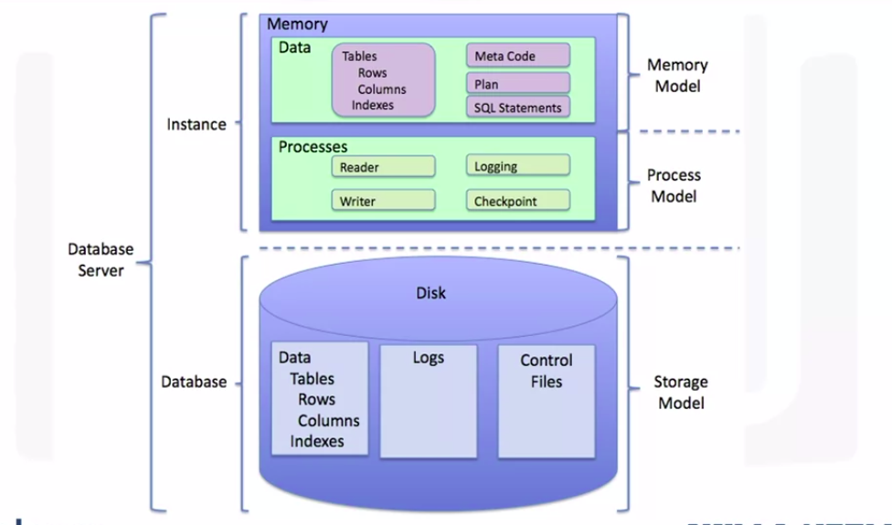</a>
	

* A relational database is formed by collections of **two-dimensional tables**;for example, **datasets** and Microsoft Excel **spreadsheets**
	* Each of these tables is then formed by a fixed number of columns and any number of rows
* The SQL language is subdivided into several language elements, including **clauses**, **expressions**, **predicates**, **queries**, and **statements**
* What makes SQL great?
	* Knowing SQL will help you do many different jobs in data science, including business and data analyst, and it's a must in data engineering
	* When performing operations with SQL, you access the data directly. There's no need to copy it beforehand. This can speed up workflow executions considerably
	* SQL is the interpreter between you and the database
	* SQL is an American National Standards Institute, or "ANSI," standard, which means if you learn SQL and use it with one database, you will be able to easily apply that SQL knowledge to many other databases
* There are many different SQL databases available, including 
	1. MySQL
	1. IBM Db2
	1. PostgreSQL
	1. Apache OpenOffice Base
	1. SQLite
	1. Oracle
	1. MariaDB
	1. Microsoft SQL Server
* The syntax of the SQL might change a little bit based on the relational database management system

## Data Science Tools

### Categories of Data Science Tools

* **Data Management** is the process of persisting and retrieving data
* **Data Integration and Transformation**, often referred to as **Extract**, **Transform**, and **Load**, or “**ETL**”, is the process of retrieving data from remote data management systems
	* Transforming data and loading it into a local data management system is also part of Data Integration and Transformation
* **Data Visualization** is part of an initial data exploration process, as well as being part of a final deliverable
* **Model Building** is the process of creating a machine learning or deep learning model using an appropriate algorithm with a lot of data
* **Model deployment** makes such a machine learning or deep learning model available to third-party applications
* **Model monitoring and assessment** ensures continuous performance quality checks on the deployed models
	* These checks are for **accuracy**, **fairness**, and **adversarial robustness**
* **Code asset management** uses versioning and other collaborative features to facilitate teamwork
* **Data asset management** brings the same versioning and collaborative components to data
	* Data asset management also supports **replication**, **backup**, and **access right management**
* **Development environments**, commonly known as **Integrated Development Environments**, or “**IDEs**”, are tools that help the data scientist to implement, execute, test, and deploy their work
* **Execution environments** are tools where **data preprocessing, model training**, and **deployment** take place
	

	  <a href="javascript:void(0)" rel="noopener">
		 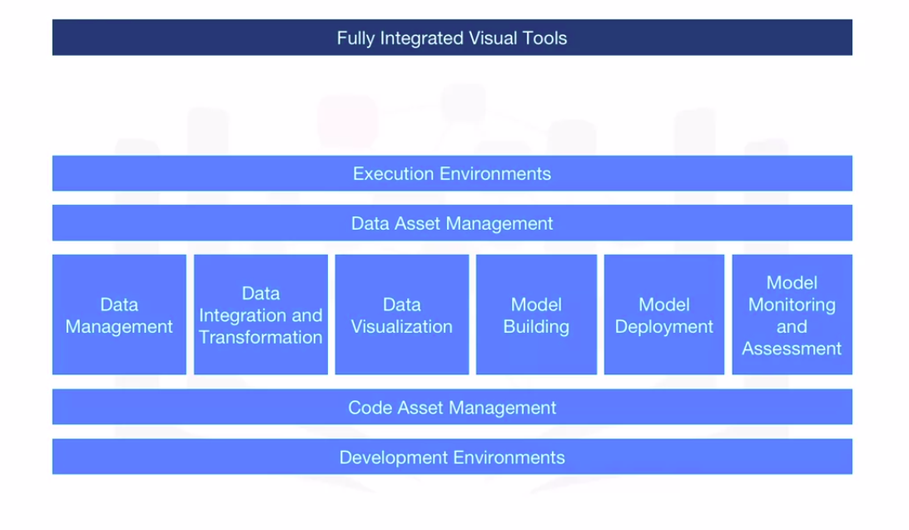</a>
	

### Open Source Tools for Data Science - Part 1

* The most widely used open source data management tools are 
	1. **Relational databases** such as **MySQL** and **PostgreSQL**
	1. **NoSQL databases** such as **MongoDB** **Apache CouchDB**, and **Apache Cassandra**
	1. **File-based tools** such as the **Hadoop File System** or **Cloud File systems** like **Ceph**
	1. Finally, **Elasticsearch** is mainly used for storing text data and creating a search index for fast document retrieval
* The task of data integration and transformation in the classic data warehousing world is called **ETL**, which stands for **Extract**, **Transform**, and **Load**
* These days, data scientists often propose the term **ELT** – **Extract, Load, Transform**
	* **ELT**, stressing the fact that data is dumped somewhere and the data engineer or data scientist themself is responsible for data
	* Another term for this process has now emerged: **Data Refinery and Cleansing**
* The most widely used open source **Data Integration and Transformation Tools**
	1. **Apache AirFlow**, originally created by AirBNB
	1. **KubeFlow**, which enables you to execute data science pipelines on top of Kubernetes
	1. **Apache Kafka**, which originated from LinkedIn
	1. **Apache Nifi**, which delivers a very nice visual editor
	1. **Apache SparkSQL** (which enables you to use ANSI SQL and scales up to compute clusters of 1000s of nodes)
	1. **NodeRED**, which also provides a visual editor
		* **NodeRED** consumes so little in resources that it even runs on small devices like a **Raspberry Pi**
			

			  
			

* The most widely used open source data visualization tools
	1. A similar approach uses **Hue**, which can create visualizations from SQL queries
	1. **Kibana**, a data exploration and visualization web application, is limited to Elasticsearch (the data provider)
	1. **Apache Superset** is a data exploration and visualization web application
		

		  <a href="javascript:void(0)" rel="noopener">
			 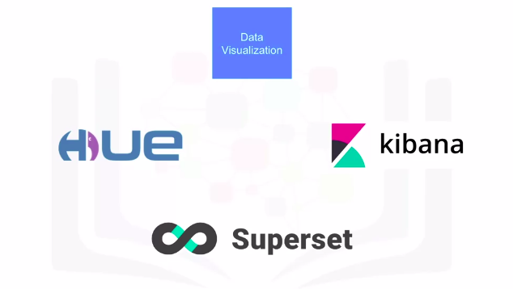</a>
		

* Once you’ve created a machine learning model capable of predicting some key aspects of the future, you should make that model consumable by other developers and turn it into an API
* Model Deployment Tools
	1. **Apache PredictionIO** currently only supports Apache Spark ML models for deployment, but support for all sorts of other libraries is on the roadmap
	1. **Seldon** is an interesting product since it supports nearly every framework, including TensorFlow, Apache SparkML, R, and scikit-learn
		* Seldon can run on top of Kubernetes and Redhat OpenShift
	1. Another way to deploy **SparkML models** is by using **MLeap**
	1. **TensorFlow** can serve any of its models using the TensorFlow service
		* You can deploy to an embedded device like a Raspberry Pi or a smartphone using **TensorFlow Lite**, and even deploy to a web browser using **TensorFlow dot JS**
			

			  
			

* Once you’ve deployed a machine learning model, you need to keep track of its prediction performance as new data arrives in order to maintain outdated models
* Model Monitoring Tools
	1. **ModelDB** is a machine model metadatabase where information about the models are stored and can be queried
		* It natively supports Apache Spark ML Pipelines and scikit-learn
	1. A generic, multi-purpose tool called **Prometheus** is also widely used for machine learning model monitoring, although it’s not specifically made for this purpose
	1. Model performance is not exclusively measured through accuracy. Model bias against protected groups like gender or race is also important. The **IBM AI Fairness 360** open source toolkit does exactly this
		* It detects and mitigates against bias in machine learning models
	1. The **IBM Adversarial Robustness 360 Toolbox** can be used to detect vulnerability to adversarial attacks and help make the model more robust
		* Machine learning models, especially neural-network-based deep learning models, can be subject to adversarial attacks, where an attacker tries to fool the model with manipulated data or by manipulating the model itself (Issue)
	1. The **IBM AI Explainability 360 Toolkit** makes the machine learning process more understandable by finding similar examples within a dataset that can be presented to a user for manual comparison
		* Machine learning modes are often considered to be a black box that applies some mysterious “magic” (Issue)
		* The **IBM AI Explainability 360 Toolkit** can also illustrate training for a simpler machine learning model by explaining how different input variables affect the final decision of the model
			

			  
			

* Code asset management tools
	1. For code asset management – also referred to as version management or version control – **Git** is now the standard
		* Multiple **services** have emerged to **support Git**, with the most prominent being **GitHub**, which provides hosting for software development version management
	1. **GitLab**, which has the advantage of being a fully open source platform that you can host and manage yourself
	1. **Bitbucket**
		

		  <a href="javascript:void(0)" rel="noopener">
			 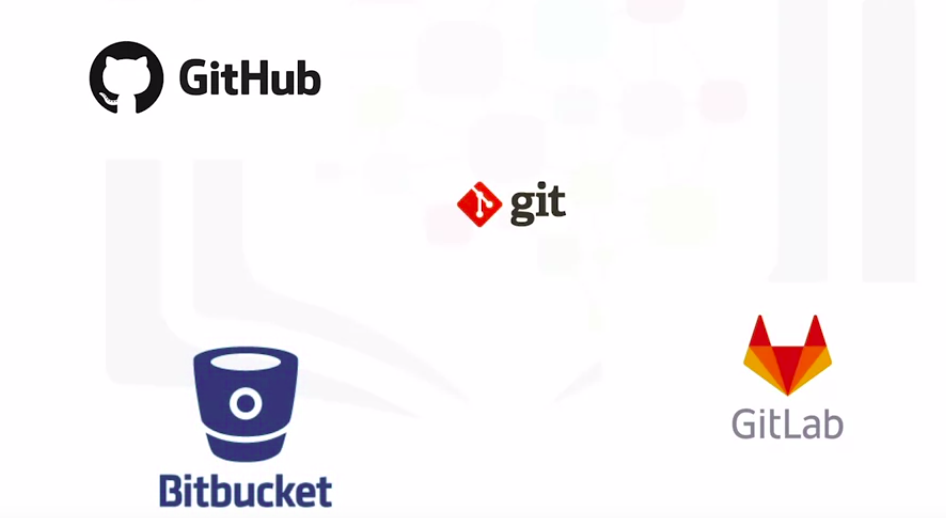</a>
		

* Data asset management, also known as data governance or data lineage, is another crucial part of enterprise grade data science
	* Data has to be versioned and annotated with metadata
* Data Asset Management Tools
	1. **Apache Atlas**
	1. **ODPi Egeria**, is managed through the Linux Foundation and is an open ecosystem
		* It offers a set of open APIs, types, and interchange protocols that metadata repositories use to share and exchange data
	1. **Kylo** is an open source data lake management software platform that provides extensive support for a wide range of data asset management tasks
		

		  <a href="javascript:void(0)" rel="noopener">
			 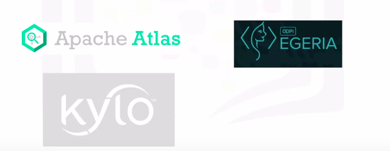</a>
		

### Open Source Tools for Data Science - Part 2

* One of the most popular current development environments that data scientists are using is **“Jupyter”**
* Jupyter first emerged as a tool for interactive Python programming; it now supports more than a hundred different programming languages through **“kernels”**
* **Kernels** shouldn’t be confused with operating system kernels
	* **Jupyter kernels** are encapsulating the different interactive interpreters for the different programming languages
* A key property of Jupyter Notebooks is the ability to unify 
	1. Documentation
	1. Code
	1. Output from the code
	1. Shell commands
	1. Visualizations into a single document
		

		  <a href="javascript:void(0)" rel="noopener">
			 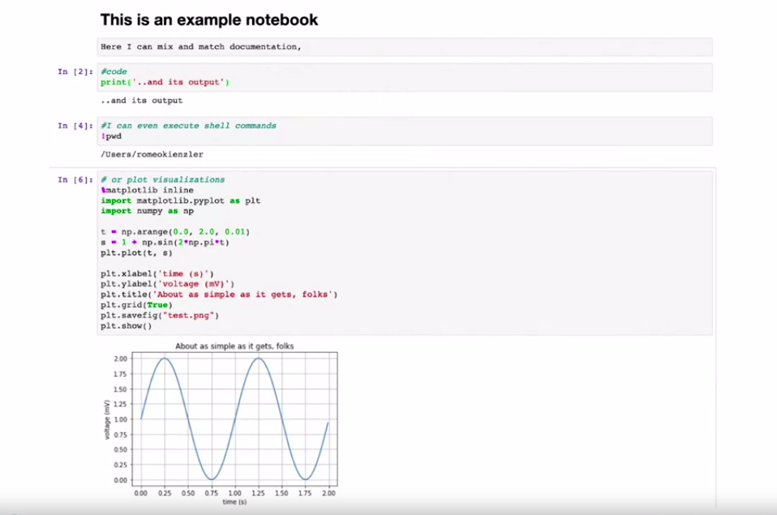</a>
		

* **JupyterLab** is the next generation of Jupyter Notebooks and in the long term, will actually replace Jupyter Notebooks
* The architectural changes being introduced in JupyterLab makes Jupyter more modern and modular
* The **main difference** introduced by JupyterLab is the ability to open different types of
	1. files, including Jupyter Notebooks
	1. data
	1. terminals
	* You can then arrange these files on the canvas
		

		  
		

* **Apache Zeppelin** has been fully reimplemented, it’s inspired by Jupyter Notebooks and provides a similar experience
	* One key differentiator is the integrated plotting capability
		

		  <a href="javascript:void(0)" rel="noopener">
			 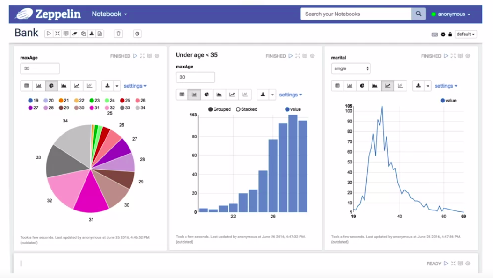</a>
		

	* In **Jupyter Notebooks**, it is required to use external libraries for plotting whereas in **Apache Zeppelin** plotting doesn’t require coding
* **RStudio** is one of the oldest development environments for statistics and data science, having been introduced in 2011
	* It exclusively runs R and all associated R libraries
	* RStudio unifies programming, execution, debugging, remote data access, data exploration, and visualization into a single tool
* **Spyder** tries to mimic the behaviour of RStudio to bring its functionality to the Python world
	* Although Spyder does not have the same level of functionality as RStudio, data scientists do consider it an alternative
	* This diagram shows how Spyder integrates code, documentation, visualizations, and other components into a single canvas
		

		  
		

* Sometimes your data doesn’t fit into a single computer’s storage or main memory capacity. That’s where **cluster execution environments** come in
* well known cluster-computing framework **Apache Spark** is among the most active Apache projects and is used across all industries, including in many Fortune 500 companies
	* The **key property** of Apache Spark is **linear scalability**
		* This means, if you double the number of servers in a cluster, you’ll also roughly double its performance
* After Apache Spark began to gain market share, **Apache Flink** was created
	* The key **difference** between **Apache Spark** and **Apache Flink** is that 
		1. **Apache Spark** is a batch data processing engine, capable of **processing** huge amounts of **data file by file**
		1. **Apache Flink**, on the other hand, is a **stream processing image**, with its main focus on processing **real-time data streams**
	* Although engine supports both data processing paradigms, **Apache Spark** is usually the choice in most use cases
* One of the latest developments in the data science execution environments is called **“Ray”**
	* which has a clear focus on large-scale deep learning model training
* Some Open Source tools for data scientists that are fully integrated and visual
	* With these tools, no programming knowledge is necessary
	* Most important tasks are supported by these tools
		* These tasks include 
			1. data integration
			1. transformation
			1. data visualization
			1. model building
	1. **KNIME** originated at the University of Konstanz in 2004
		* KNIME has a visual user interface with drag-and-drop capabilities
		* It also has built-in visualization capabilities
		* Knime can be be extended by programming in R and Python, and has connectors to Apache Spark
			

			  <a href="javascript:void(0)" rel="noopener">
				 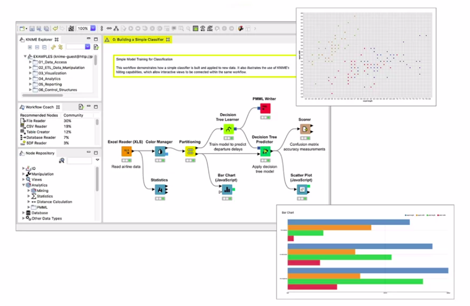</a>
			

	1. **Orange**
		* It’s less flexible than KNIME, but easier to use
			

			  <a href="javascript:void(0)" rel="noopener">
				 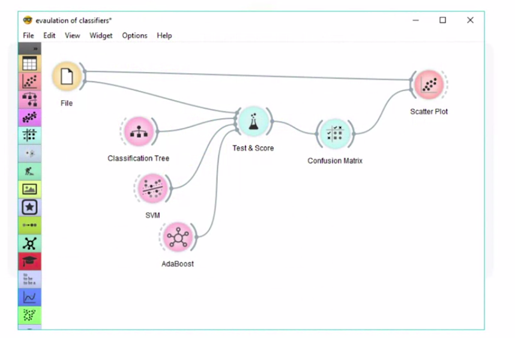</a>
			

### Commercial Tools for Data Science

* Overview of Different product category:
	

	  
	

* In **Data Management**, most of an enterprise’s relevant data is stored in an Oracle Database, Microsoft SQL Server, or IBM Db2
	* Although open source databases are gaining popularity, those three data management products are still considered the industry-standard
	* Data is at the heart of every organization, and the availability of commercial supports plays a major role
		* Commercial supports are delivered directly from software vendors, influential partners, and support networks
* **Commercial Data Integration Tools**, OR **Extract, Transform, and Load**, or **ETL tools**
	* These tools support design and deployment of ETL data-processing pipelines through a graphical interface
	* They also provide connectors to most of the commercial and open source target information systems.
		* According to a Gartner Magic Quadrant, **Informatica Powercenter** and **IBM InfoSphere DataStage** are the leaders
		* Other **ETL** tools **providers** are **SAP**, **Oracle**, **SAS**, **Talend**, and **Microsoft**
		* **Watson Studio Desktop** includes a component called **Data Refinery**, which enables the defining and execution of data integration processes in a spreadsheet style
* **Data Visualization**
	* In the commercial environment, data visualizations are utilizing business intelligence, or “BI” tools
	* Their main focus is to create visually attractive and easy-to-understand reports and live dashboards
	* The most prominent commercial examples are: **Tableau**, **Microsoft Power BI**, and **IBM Cognos Analytics**
	* Another type of visualization targets data scientists rather than regular users. A sample problem might be **“How can different columns in a table relate to each other?”**
		* This type of functionality is contained in **Watson Studio Desktop**
			

			  
			

* **Model Building**
	* If you want to build a machine learning model using a commercial tool, you should consider using a data mining product
		* The most prominent of these types of products are: **SPSS Modeler** and **SAS Enterprise Miner**
		* In addition, A version of **SPSS Modeler** is also **available** in **Watson Studio Desktop**, based on the cloud version of the tool
* **Model Deployment**
	* In commercial software, model deployment is tightly integrated in the model building process
	* Diagram below shows an example of the SPSS Collaboration and Deployment Services which are used to deploy any type of asset created by the SPSS software tools suite
		

		  <a href="javascript:void(0)" rel="noopener">
			 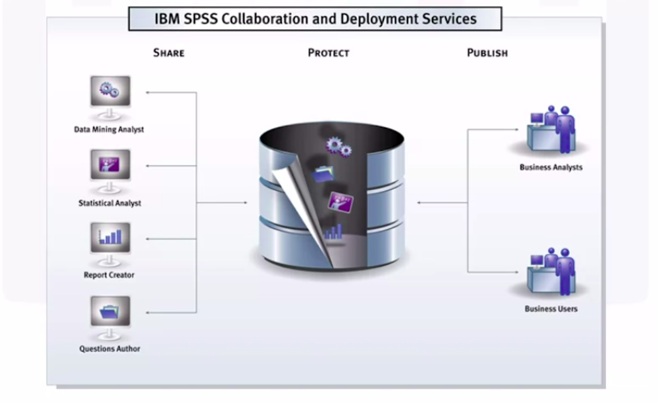</a>
		

	* Commercial software can also export models in an open format
		* For example, **SPSS Modeler** supports the exporting of models as **Predictive Model Markup Language**, or **PMML**, which can be read by many other commercial and open software packages
* **Model Monitoring and Assessment**
	* Model monitoring is a new discipline and there are currently no relevant commercial tools available. As a result, open source is the first choice.
* **Code Asset Management**
	* Open source with Git and GitHub is the effective standard
* **Data Asset Management**
	* Data asset management, often called data governance or data lineage, is a crucial part of enterprise grade data science
	* Data must be versioned and annotated using metadata
	* Vendors, including Informatica Enterprise Data Governance and IBM, provide tools for these specific tasks
	* The **IBM InfoSphere** Information Governance Catalog covers functions like data dictionary, which facilitates discovery of data assets
	* Each data asset is assigned to a **data steward** -- the **data owner**
		* The data owner is responsible for that data asset and can be contacted
	* **Data lineage** is also covered; this enables a user to track back through the transformation steps followed in creating the data assets
		* The **data lineage** also includes a reference to the actual source data
	* Rules and policies can be added to reflect complex regulatory and business requirements for data privacy and retention
* **Development Environments**
	1. __Watson Studio__
		* Watson Studio is a fully integrated development environment for data scientists
		* __Watson Studio Desktop__ combines Jupyter Notebooks with graphical tools to maximize data scientists’ performance
		* __Watson Studio__, together with __Watson Open Scale__, is a fully integrated tool covering the full data science life cycle and all the tasks
			* They can be deployed in a local data center on top of __Kubernetes__ or __RedHat OpenShift__
	1. __H2O Driverless AI__
		* Fully integrated commercial tool H2O Driverless AI, also covers the complete data science life cycle

### Cloud Based Tools for Data Science

* Overview of Different product category:
	

	  
	

* Since cloud products are a newer species, they follow the trend of having multiple tasks integrated in tools
* This especially holds true for the tasks marked green in the diagram
	

	  <a href="javascript:void(0)" rel="noopener">
		 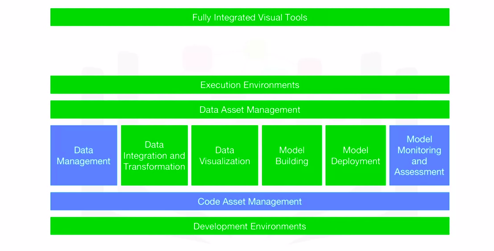</a>
	

* **Fully Integrated Visual Tools and Platform**
	* These clusters are composed of multiple server machines, transparently for the user, in the background
	1. **Watson Studio**, together with **Watson OpenScale**, covers the complete development life cycle for all data science, machine learning, and AI tasks
	1. **Microsoft Azure Machine Learning**
		* This is also a fully cloud-hosted offering supporting the complete development life cycle of all data science, machine learning, and AI tasks
	1. **H2O Driverless AI**
		* It is a product that you download and install, one-click deployment is available for the common cloud service providers
		* Operations and Maintenance are not done by the cloud provider, as is the case with Watson Studio, Open Scale, and Azure Machine Learning, this delivery model should not be confused with **Platform or Software as a Service** -- **PaaS** or **SaaS**
* **Data Management**
	* In data management, with some exceptions, there are SaaS versions of existing open source and commercial tools
	* SaaS stands for “software as a service.”
		* It means that the cloud provider operates the tool for you in the cloud
		* For example, the cloud provider operates the product by backing up your data and configuration and installing updates
	* As mentioned, there is proprietary tooling, which is only available as a cloud product
	* Sometimes it’s only available from a single cloud provider
	* For example 
		1. Amazon Web Services DynamoDB, a NoSQL database that allows storage and retrieval of data in a key-value or a document store format
			* The most prominent document data structure is JSON (pronounced “jay-sun”)
		1. Cloudant Service, which is a database-as-a-service offering
			* But, under the hood it is based on the open source Apache CouchDB
			* It has an advantage: although complex operational tasks like updating, backup, restore, and scaling are done by the cloud provider, under the hood this offering is compatible with CouchDB
				* Therefore, the application can be migrated to another CouchDB server without changing the application
		1. IBM offers Db2 as a service
			* This is an example of a commercial database made available as a software-as-a-service offering in the cloud, taking operational tasks away from the user
* **Data Integration and Transformation**
	* When it comes to Commercial Data Integration Tools, we talk not only about **Extract, Transform and Load** or **ETL** tools, but also about **Extract, Load, and Transform** or **ELT** tools
		* This means the transformation steps are not done by a data integration team but are pushed towards the domain of the data scientist or data engineer
	* Two widely used commercial data integration tools are
		1. Informatica Cloud Data Integration
		1. IBM’s Data Refinery
			* Data Refinery enables transformation of large amounts of raw data into consumable, quality information in a spreadsheet-like user interface
			* Data Refinery is part of IBM Watson Studio
* **Data Visualization**
	* An example of a smaller company’s cloud-based data visualization tool is **DataMeer**
	* **IBM** offers it’s famous **Cognos Business Intelligence Suite** as cloud solution as well
	* **IBM Data Refinery** also offers data exploration and visualization functionality in Watson Studio
	* For example
		1. 3D bar chart enables you to visualize a target value on the vertical dimension, which is dependent on two other values on the horizontal dimensions
			* Coloring enables you to visualize a third dimension
				

				  
				

		1. Hierarchical edge bundling enables you to visualize correlations and affiliations between entities
			

			  <a href="javascript:void(0)" rel="noopener">
				 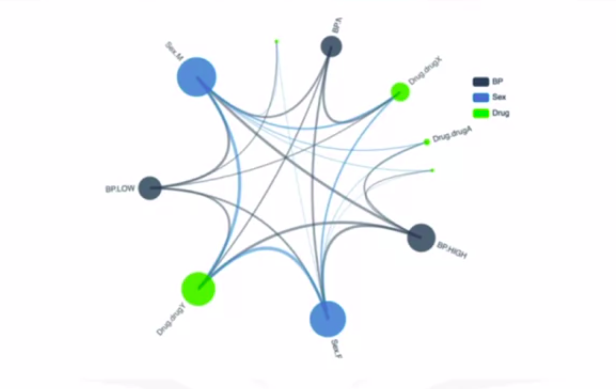</a>
			

		1. A classic bar chart can do the job as well
			

			  
			

		1. A 2D scatter plot with a heat map shows two dependent data fields, one on the y-axis and one as color intensity
			

			  
			

		1. A tree map shows distribution of subsets within a set
			

			  
			

		1. The famous pie chart does the same but in a non-hierarchical manner
			

			  <a href="javascript:void(0)" rel="noopener">
				 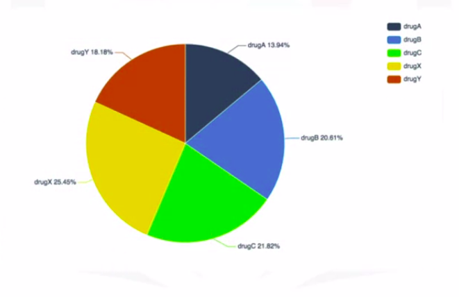</a>
			

		1. A word cloud pops out significant terms in a document corpus
			

			  
			

* Model Building
	* Model building can be done using a service such as 
		1. Watson Machine Learning
			* Watson Machine Learning can train and build models using various open source libraries
		1. Google has a similar service on their cloud called **AI Platform Training**
	* Nearly every cloud provider has a solution for this task
* Model Deployment
	* Model deployment in commercial software is usually tightly integrated to the model building process
		1. **SPSS Collaboration and Deployment Services**
			* An example of the SPSS Collaboration and Deployment Services, which can be used to deploy any type of asset created by the SPSS software tools suite
				

				  
				

			* Commercial software can export models in an open format
				* As an example, SPSS Modeler supports exporting models as **Predictive Model Markup Language**, or **PMML** which can be read by numerous other commercial and open software packages
		1. **Watson Machine Learning** can also be used to deploy a model and make it available to consumers using a REST interface
		1. **Amazon SageMaker Model Monitor** is an example of a cloud tool that continuously monitors deployed machine learning and deep learning models
	* **Watson OpenScale and Watson Studio** unify the landscape
		* Everything marked in green (in image below) can be done using Watson Studio and Watson OpenScale
			

			  <a href="javascript:void(0)" rel="noopener">
				 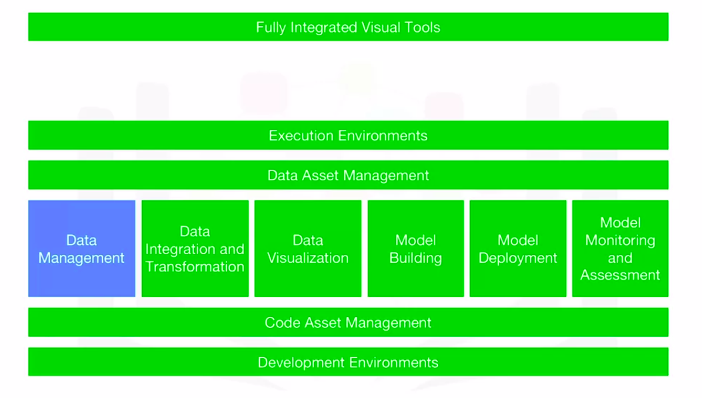</a>
			

> Integration provides us the ability to use the same tools for multiple tasks

## Packages, APIs, Data Sets and Models

### Libraries for Data Science

* Libraries are a collection of functions and methods that enable you to perform a wide variety of actions without writing the code
* Python Libraries
	1. Scientific Computing Libraries in Python
	1. Visualization Libraries in Python
	1. High-Level Machine Learning and Deep Learning Libraries
		* High-level simply means you don’t have to worry about details
	1. Deep Learning Libraries
* __Libraries__ usually contain built-in modules providing different functionalities that you can use directly
	* these are sometimes called **frameworks**
* Scientifics Computing Libraries
	1. **Pandas**
		* Pandas offers data structures and tools for effective 
			1. Data cleaning
			1. Manipulation
			1. Analysis
		* It provides tools to work with different types of data
		* The primary instrument of Pandas is a two-dimensional table consisting of columns and rows
			* This table is called a **DataFrame** and is designed to provide easy indexing so you can work with your data
	1. **Numpy**
		* NumPy libraries are based on arrays, enabling you to apply mathematical functions to these arrays
		* Pandas is actually built on top of NumPy
* Data Visualization Libraries
	* Data Visualization Methods are a great way to communicate with others and show the meaningful results of analysis. These libraries enable you to create graphs, charts and maps
		1. The Matplotlib 
			* The Matplotlib package is the most well-known library for data visualization, and it’s excellent for making graphs and plots
			* The graphs are also highly customizable
		1. Seaborn
			* Seaborn, is based on matplotlib
			* Seaborn makes it easy to generate plots like heat maps, time series, and violin plots
* Machine Learning and Deep Learning Libraries
	1. the Scikit-learn library
		* the Scikit-learn library contains tools for statistical modeling, including regression, classification, clustering and others
		* It is built on NumPy, SciPy, and matplotlib, and it’s relatively simple to get started
		* For this high-level approach, you define the model and specify the parameter types you would like to use
	1. Keras
		* Keras enables you to build the standard deep learning model
		* Like Scikit-learn, the high-level interface enables you to build models quickly and simply
		* It can function using graphics processing units (GPU)
* Deep Learning Libraries
	1. TensorFlow
		* For many deep learning cases a lower-level environment is required
		* TensorFlow is a low-level framework used in large scale production of deep learning models
		* It’s designed for production but can be unwieldy for experimentation
	1. PyTorch
		* Pytorch is used for experimentation, making it simple for researchers to test their ideas
* Apache Spark
	* Apache Spark is a general-purpose cluster-computing framework that enables you to process data using compute clusters
		* This means that you process data in parallel, using multiple computers simultaneously
	* The Spark library has similar functionality as Pandas, Numpy, Scikit-learn
	* Apache Spark data processing jobs can use Python, R, Scala or SQL
	* There are many libraries for Scala, which is predominately used in data engineering but is also sometimes used in data science
	* Scala Libraries
		* Vegas
			* Vegas is a Scala library for statistical data visualizations
			* With Vegas, you can work with data files as well as Spark DataFrames
		* BigDL
			* This library is used for Deep Learning
* R-Libraries
	* R has built-in functionality for machine learning and data visualization, but there are also several complementary libraries
		1. ggplot2 is a popular library for data visualization in R
	* R can also use libraries that enable you to interface with Keras and TensorFlow
	* R has been the de-facto standard for open source data science but it is now being superseded by Python

### Application Programming Interfaces (API)

* **API**
	* An **API** lets two pieces of software talk to each other
	* For example 
		* Suppose, there is a program, some data, and other software components. the API is used to communicate with the other software components
			* User don’t have to know how the API works, user just need to know its inputs and outputs
	* Remember, the **API** only refers to the interface, or the part of the library that you see. The **library** refers to the whole thing
		

		  
		

		

		  <a href="javascript:void(0)" rel="noopener">
			 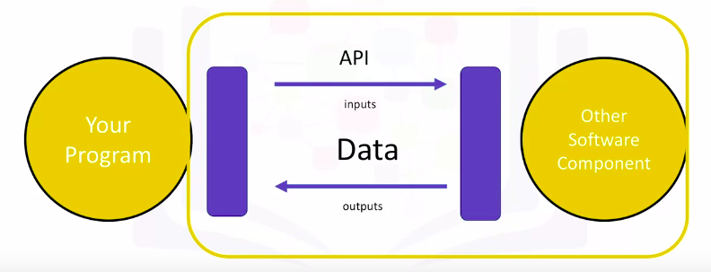</a>
		

* Pandas Library
	* Pandas is actually a set of software components, many of which are not even written in Python
	* We use the pandas API to process the data by communicating with the other software components
		

		  
		

* There can be a single software component at the back end, but there can be a separate API for different languages
	* Consider TensorFlow, written in C++. There are separate APIs in Python, JavaScript, C++ Java, and Go
* The __API__ is simply the __interface__
* There are also multiple volunteer-developed __APIs__ for __TensorFlow__, for example __Julia__, __MATLAB__, __R__, __Scala__
* __REST APIs__ are another popular type of API
	* They enable you to communicate using the internet, taking advantage of storage, greater data access, artificial intelligence algorithms, and many other resources
	* The __RE__ stands for __Representational__, the __S__ stands for __State__ the __T__ stand for __Transfer__
	* In rest APIs, your program is called the “client.” 
	* The API communicates with a web service that you call through the internet
	* A set of rules governs Communication, Input or Request, and Output or Response
* How it works and terms
	* You or your code can be thought of as a client
	* The **web service** is referred to as a **resource**
	* The **client** finds the service through an **endpoint**
	* The **client** sends the **request** to the **resource** and the **response** to the **client**
		

		  
		

* **HTTP methods** are a way of transmitting data over the internet
	* We tell the **REST APIs** what to do by sending a request
	* The request is usually communicated through an HTTP message
	* The HTTP message usually contains a JSON file, which contains instructions for the operation that we would like the service to perform
	* This operation is transmitted to the web service over the internet
	* The service performs the operation
	* Similarly, the web service returns a response through an HTTP message, where the information is usually returned using a **JSON file**
	* This information is transmitted back to the client
		

		  
		

* The **Watson Speech to Text API** is an example of a REST API
	* This API converts speech to text
	* In the API call, you send a copy of the audio file to the API; this process is called a **post request**
	* The API then sends the text transcription of what the individual is saying
		* The API is making a **get request**
* The **Watson Language-Translator API**
	* You send the text you would like to translate into the API, the API translates the text and sends the translation back

### Data Sets - Powering Data Science

* A **data set** is a structured collection of data
* **Data** embodies information that might be represented as 
	1. text
	1. numbers
	1. media such as 
		1. images
		1. audio
		1. video files
* A **data set** that is structured as tabular data comprises a collection of rows, which in turn comprise columns that store the information
	* One popular tabular data format is __comma separated values__ or __CSV__
		

		  
		

* A __CSV__ file is a delimited text file where each line represents a row and data values are separated by a __comma (,)__
* **Hierarchical** or **Network** data structures are typically used to represent relationships between data
	* **Hierarchical data** is organized in a **tree-like structure**
	* **Network data** might be stored as a **graph**
		

		  
		

	* For example, the connections between people on a social networking website are often represented in the form of a graph
* A data set might also include raw data files, such as images or audio
* The **MNIST dataset** is popular for data science
	* It contains images of handwritten digits and is commonly used to train image processing systems
* Private Data Sets
	* Traditionally, most data sets were considered to be private because they contain proprietary or confidential information such as
		1. customer data
		1. pricing data
		1. other commercially sensitive information
	* These data sets are typically not shared publicly.
	* Private data 
		1. Confidential
		1. Private or personal information
		1. Commercially sensitive
* Open Data
	* Nowadays, more and more public and private entities such as **scientific institutions**, **governments**, **organizations** and even **companies** have started to make data sets available to the public as **Open Data** providing a wealth of information for free
	* This type of Dataset is publically available
	* For example, the United Nations and federal and municipal governments around the world have published many data sets on their websites, covering the economy, society, healthcare, transportation, environment, and much more
	* Access to these and other open data sets enable data scientists, researchers, analysts, and others to uncover previously unknown and potentially useful insights
		* They can create new applications for both commercial purposes and the public good. They can also carry out new research
	* **Open data** has played a significant role in the growth of data science, machine learning, and artificial intelligence and has provided a way for practitioners to hone their skills on a wide variety of data sets
* Where to find Open Data sets
	1. Open data portal list from around the world
		* http://datacatalogs.org/
	1.  The United Nations, the European Union, and many other governmental and intergovernmental organizations maintain data repositories providing access to a wide range of information
		1. http://data.un.org/ - United Nations
		1. https://www.data.gov/ - USA
		1. https://www.europeandataportal.eu/en/ - Europe
	1. Kaggle
		* On Kaggle, which is a popular data science online community, where anyone can find and contribute data sets that might be of general interest
			1. https://www.kaggle.com/datasets/
	1. Google
		* Google provides a search engine for data sets that might help find the ones that have particular value to the person searching them
			1. https://datasetsearch.research.google.com/
* Community Data License Agreement
	* It’s important to recognize that open data distribution and use might be restricted, as defined by its licensing terms
	* In absence of a license for open data distribution, many data sets were shared in the past under open source software licenses
	* The Linux Foundation created the **Community Data License Agreement**, or **CDLA**
	* Two licenses were initially created for sharing data: 
		1. CDLA-Sharing
			* The CDLA-Sharing license grants user permission to use and modify the data
			* The license stipulates that user publish the modified version of the data you must do so under the same license terms as the original data
		1. CDLA-Permissive
			* The CDLA-Permissive license also grants user permission to use and modify the data
			* However, user is not required to share changes to the data
	* **Note** that neither license imposes any restrictions on results you might derive by using the data, which is important in data science
	* For Example:
		* If you are training the model using CDLA-licensed data sets, you are under no obligation to share the model, or to share it under a specific license if you do choose to share it

### Sharing Enterprise Data - Data Asset eXchange

* Despite the growth of open data sets that are available to the public, it can still be difficult to discover data sets that are both high quality and have clearly defined license and usage terms
* To solve this challenge, **IBM** created the **Data Asset eXchange**, or **DAX**
* __Data Asset eXchange__
	* **DAX** provides a trusted source for finding open data sets that are ready for to use in enterprise applications
	* These data sets and which cover a wide variety of domains, including images, video, text, and audio
	* DAX provides a high level of curation for data set quality, as well as licensing and usage terms, DAX data sets are typically easier to adopt, whether in research or commercial projects
	* Wherever possible, DAX aims to make data sets available under one of the variants of the CDLACommunity Data License Agreement, in order to foster data sharing and collaboration
	* DAX also provides a single place to access unique data sets, in particular from IBM Research projects
	* DAX also provides tutorials in the form of notebooks that walk through the basics of data cleaning, pre-processing, and exploratory analysis, to help developers to get started with using the dataset
	* For some data sets, there are also notebooks illustrating how to perform more complex analysis, such as 
		1. creating charts
		1. statistical analysis
		1. time-series analysis
		1. training machine learning models
		1. integrating deep learning via using the **Model Asset eXchange**, (a project closely related to DAX and also available on the IBM Developer website)
	* In this way, DAX helps developers to create end-to-end analytic and machine learning workflows and to consume open data and models with confidence under clearly defined license terms
	* After finding the dataset of interest, user can
		1. download the compressed data set archive from cloud storage
		1. explore the data set using Jupyter Notebooks
		1. review the data set metadata, such as format, licensing terms and size
		1. preview some parts of the data set
			

			  <a href="javascript:void(0)" rel="noopener">
				 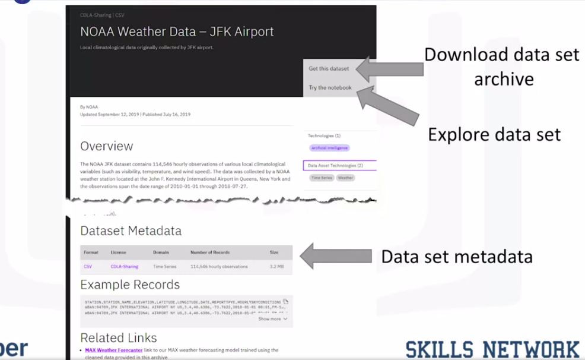</a>
			

	* Most data sets on DAX are complemented by one or more Jupyter Notebooks that you can use to perform **data cleaning**, **pre-processing**, and **exploratory Analysis**
		* These notebooks run "as is"as is in Watson Studio, IBM’s Data Sciencedata science platform

### Machine Learning Models

* Data contains a wealth of information that can be used to solve certain types of problems
* Traditional data analysis approaches, such as a person manually inspecting the data or a specialized computer program that automates the human analysis, quickly reach their limits due to the amount of data to be analyzed or the complexity of the problem
* Machine learning uses algorithms – also known as **Models** - to identify patterns in the data
* The process by which the model learns these patterns from data is called **Model Training**
	* __Once__ a model is __trained__, it can then be __used__ to make __predictions__
	* When the model is presented with new data, it tries to make predictions or decisions based on the patterns it has learned from past data
* Machine learning models can be divided into three basic classes
	1. Supervised Learning
	1. Unsupervised Learning
	1. Reinforcement Learning
* **Supervised Learning**
	* **Supervised Learning** is one of the most commonly used type of machine learning models
	* In **Supervised Learning**, a human provides input data and the correct outputs
		* The model tries to identify relationships and dependencies between the input data and the correct output
	* Generally speaking, supervised learning is used to solve **regression** and **classification** problems
		* An example for each problem type
			1. Regression models are used to predict a **numeric**, or **real**, value
				* For __example__, given information about past home sales, such as geographic location, size, number of bedrooms, and sales price, you can train a model to predict the estimated sales price for other homes with similar characteristics
			1. Classification models are used to predict whether something belongs to a **category**, or **class**
				* For __example__, given a set of emails along with a designation of whether or not they are considered spam, an algorithm can be trained to identify unsolicited emails
* **Unsupervised Learning**
	* In **Unsupervised Learning**, the data is not labelled by a human
	* The models must analyze the data and try to identify patterns and structure within the data based only on the characteristics of the data itself
	* __Clustering__ and __Anomaly Detection__ are two examples of this learning style
	* __Clustering Model__
		* Clustering models are used to divide each record of a data set into one of a small number of similar groups
		* An example of a clustering model could be providing purchase recommendations for an e-commerce store based on past shopping behavior and the content of a shopping basket
	* __Anomaly Detection Model__
		* Anomaly detection identifies outliers in a data set, such as fraudulent credit card transactions or suspicious online log-in attempts
* **Reinforcement Learning**
	* __Reinforcement Learning__, is loosely based on the way human beings and other organisms learn
	* For Example
		* Think about a mouse in a maze. If the mouse gets to the end of the maze it gets a piece of cheese. This is the “reward” for completing a task. The mouse learns – through trial and error – how to get through the maze to get as much cheese as it can
	* Similarly (like example mentioned above), A reinforcement learning model learns the best set of actions to take, given its current environment, in order to get the most reward over time
		* This type of learning has recently been very successful in beating the best human players in games such as go, chess, and popular strategy video games
* **Deep Learning**
	* __Deep Learning__ is a specialized type of machine learning
	* It refers to a general set of models and techniques that tries to loosely emulate the way the human brain solves a wide range of problems
	* It is commonly used to analyze natural language, both spoken and text, as well as images, audio, and video, to forecast time series data, etc
		* Deep learning has had a lot of recent success in these and other areas and is therefore becoming an increasingly popular and important tool for data science
	* Deep learning typically __requires__ very __large data sets__ of labeled data to train a model, is __compute-intensive__, and usually __requires__ special purpose __hardware__ to achieve acceptable training times
	* User can build a custom deep learning model from scratch or use pre-trained models from public model repositories
	* Deep learning __Models__ are implemented using popular frameworks such as __TensorFlow__, __PyTorch__, and __Keras__
	* Deep learning __Frameworks__ typically provide a __Python__ API, and many support other programming languages, such as __C++__ and __JavaScript__
	* Pre-trained state-of-the-art models can be downloaded from repositories that are commonly referred to as **Model Zoos**
	* Popular model zoos include those provided by __TensorFlow__, __PyTorch__, __Keras__, and __ONNX__
* Assume you want to enable an application to identify objects in images by training a deep learning model
	1. First, you collect and prepare data that will be used to train a model
		* **Data preparation** can be a time-consuming and labor-intensive process
		* In order to **train a model** to detect objects in images, you need to **label** the **raw training data** by **drawing bounding boxes** around objects and **labeling** them
	1. Next, you build a model from scratch or select an existing model that might be well suited for the task from a public or private resource
	1. Then train the model on your prepared data. During training, your model learns from the labeled data how to identify objects that are depicted in an image
	1. Once training has commenced, you analyze the training results and repeat the process until the trained model performance meets your requirements
	1. When the trained model performs as desired, you deploy it to make it available to your applications

### The Model Asset Exchange

* Due to the amount of data, labor, time, and resources required to complete the tasks, **Time to Value** can be quite long
	* To reduce time to value, consider taking advantage of pre-trained models for certain types of problems
	* These pre-trained models can be ready to use right away, or they might take less time to train
* **Model Asset eXchange** - **MAX**
	* The Model Asset eXchange is a free open source repository for ready-to-use and customizable deep learning microservices
	* These microservices are configured to use pre-trained or custom-trainable state-of-the-art deep learning models to solve common business problems
	* These models have been reviewed, tested, and can be quickly deployed in local and cloud environments
	* All models in __MAX__ are available under permissive open source licenses, making it easier to use them for personal and commercial purposes and reducing the risk of legal liabilities
	* On __MAX__, you can find models for a variety of domains, including 
		1. Object Detection (Which object are in image)
		1. Named Entity recognition (Identify entities in text)
		1. Image, Audio, and Text Classification 
		1. Video
		1. Natural Language Analysis
		1. Human pose detection
		1. Image-to-text translation (generate image caption)
	* 
* The components of a typical model-serving microservice
	* Each microservice includes the following components
		1. A pre-trained deep learning model
		1. Code that pre-processes the input before it is analyzed by the model
		1. Code that post-processes the model output
		1. A standardized public API that makes the services’ functionality available to applications
	* The MAX model-serving microservices are built and distributed as open-source Docker images
			

			  
			

	* **Docker** is a container platform that makes it easy to build applications and to deploy them in a development, test, or production environment
		* The Docker image source is published on GitHub and can be downloaded, customized as needed, and used in personal or commercial environments
		* These can be deployed and run these images in a test or production environment using **Kubernetes**
			* **Kubernetes** is an open-source system for __automating deployment__, __scaling__, and __management__ of containerized applications in private, hybrid, or public __clouds__
			* A popular enterprise-grade Kubernetes platform is **Red Hat OpenShift**, which is available on 
				1. IBM Cloud
				1. Google Cloud Platform
				1. Amazon Web Services
				1. Microsoft Azure
* Model-Serving Microservices API
	* The model-serving microservices expose a REST API that developers can use to incorporate deep learning into their applications and services
	* REST APIs can be consumed using any programming language, you can easily integrate these services into your existing ecosystem
	* The API exposes a prediction endpoint and one or more metadata endpoints
	* Example (Image below) shows the endpoints for the Object Detection microservice
			

			  <a href="javascript:void(0)" rel="noopener">
				 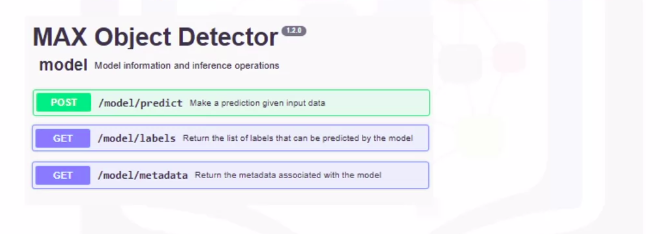</a>
			

		* The `/model/predict` endpoint takes an image as input and returns as a response a list of objects that were detected in the image, along with bounding box coordinates that identify where the detected object is located
		* Some prediction endpoints can also accept additional input parameters that impact the produced results, such as filters
		* This microservice exposes two metadata endpoints, `/model/labels` and `/model/metadata`
			* These endpoints provide information such as the objects that can be detected and the deep learning model used to derive the answer given the input
		* Each endpoint accepts application-friendly inputs, such as an image in JPG, PNG, or GIF format, instead of a model-specific data structure
		* Each endpoint also generates application-friendly outputs, such as standardized JSON, which is a lightweight data-interchange format
			

			  <a href="javascript:void(0)" rel="noopener">
				 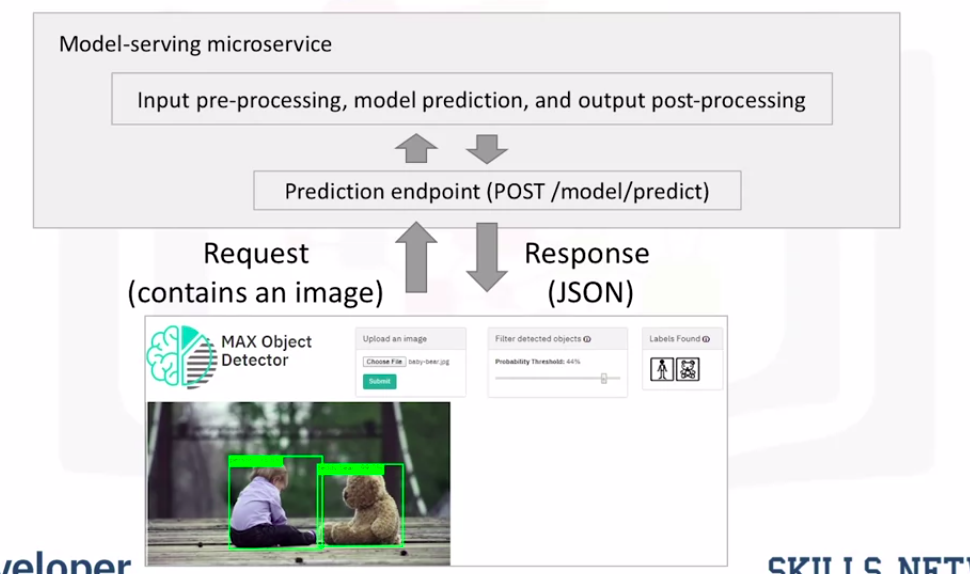</a>
			
