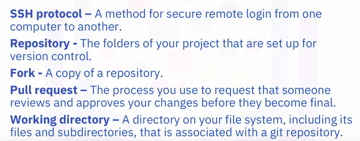
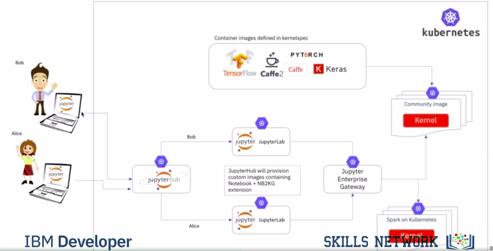
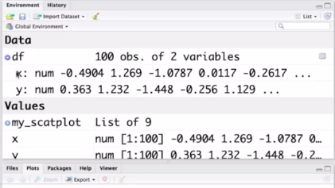
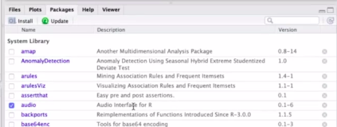
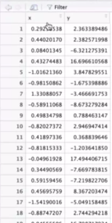
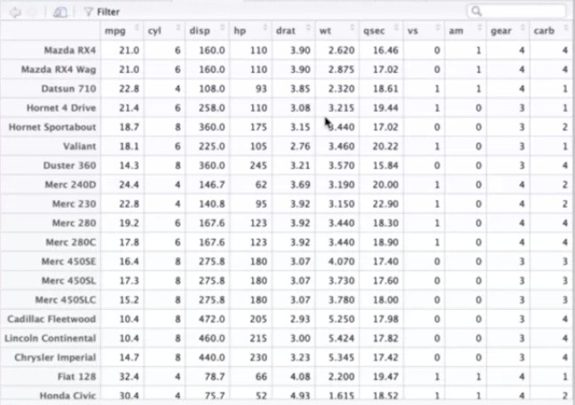
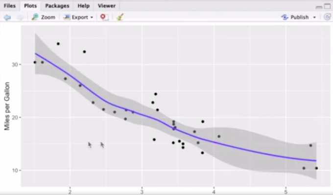

Tools for Data Science
======================

by IBM

# Module 2

## Key Concepts
* Explain how to use GitHub to create and manage source code for data science projects
* Describe the features of Jupyter Notebook that make it popular for data science projects
* Describe the features of RStudio IDE that make it popular for data science projects

#
## Title: Open Source Tools

## GitHub

### Overview of Git/GitHub

* Version Control
	* A version control system allows you to keep track of changes to your documents
	* This makes it easy for you to recover older versions of your document if you make a mistake, and it makes collaboration with others much easier
	* For Example
		* Let’s say you’ve got a shopping list and you want your roommates to confirm the things you need and add additional items
			* Without version control, you’ve got a big mess to clean up before you can go shopping
			* With version control, you know EXACTLY what you need after everyone has contributed their ideas
				<p align="center">
				  <a href="javascript:void(0)" rel="noopener">
					 </a>
				</p>
				<p align="center">
				  <a href="javascript:void(0)" rel="noopener">
					 </a>
				</p>
* Git
	* __Git__ is free and open source software distributed under the __GNU General Public License__
	* Git is a distributed version control system, which means that users anywhere in the world can have a copy of your project on their own computer
		* when they’ve made changes, they can sync their version to a remote server to share it with you
	* Git isn’t the only version control system out there, but the distributed aspect is one of the main reasons it’s become one of the most common version control systems available
	* Version control systems are widely used for things involving code, but you can also version control
		1. images
		1. documents
		1. any number of file types
	* Git can be used without a web interface by using your command line interface, but GitHub is one of the most popular web-hosted services for Git repositories
		* Others include GitLab, BitBucket, and Beanstalk
* Basic Important Terms
	* The __SSH protocol__ is a method for secure remote login from one computer to another
	* A __repository__ contains your project folders that are set up for version control
	* A __fork__ is a copy of a repository
	* A __pull request__ is the way you request that someone reviews and approves your changes before they become final
	* A __working directory__ contains the files and subdirectories on your computer that are associated with a Git repository
		<p align="center">
		  <a href="javascript:void(0)" rel="noopener">
			 </a>
		</p>
* Basic Git Commands
	* __git init__
		* When starting out with a new repository, you only need create it once: either locally, and then push to GitHub, or by cloning an existing repository by using the command __git init__
	* __git add__ moves changes from the working directory to the staging area
	* __git status__ allows you to see the state of your working directory and the staged snapshot of your changes
	* __git commit__ takes your staged snapshot of changes and commits them to the project
	* __git reset__ undoes changes that you’ve made to the files in your working directory
	* __git log__ enables you to browse previous changes to a project
	* __git branch__ lets you create an isolated environment within your repository to make changes
	* __git checkout__ lets you see and change existing branches
	* __git merge__ lets you put everything back together again
* Learning material
	* Go to https://try.github.io to download the cheat sheets and run through the tutorials

### GitHub on Mac/Linux - Part 1

* Nothing to write down as notes

### GitHub on Mac/Linux - Part 2

* Nothing to write down as notes

### GitHub on Mac/Linux - Part 3

* Nothing to write down as notes

## Jupyter Notebook and JupyterLab

### Getting Started with Jupyter Notebook

* Nothing to write down as notes

### Getting Started with JupyterLab

* Nothing to write down as notes

### Jupyter Architecture

* Jupyter Notebook Architecture
		<p align="center">
		  <a href="javascript:void(0)" rel="noopener">
			 </a>
		</p>
	* user, which interacts with a browser
	* the central component in Jupyter is the notebook server
		* So the notebook server is loading and storing the jupyter notebook file and sends the html content to the browser
	* Once this html content in the browser is rendered it interacts with the notebook server using websockets
	* So its a split application the UI runs in the browser using javascript. And the notebook server is responsible for keeping state, and the second thing is, it is communicating with a so called __kernel__
		* So the __kernel__ is a wrapper, which wraps the execution framework , for example the python interpreter
* Jupyter Enterprise Gateway : Architecture Diagram
		<p align="center">
		  <a href="javascript:void(0)" rel="noopener">
			 </a>
		</p>


## RStudio IDE

### What is RStudio IDE?

* **RStudio** is **IDE**, **I**ntegrated **D**evelopment **E**nvironment, and it's made for the programming language **R**
* **R** is a statistical programming language which has been **derived** from the closed source **S language**
* R is open source, RStudio is open source, and it's completely for free
* The central data structure in R is a DataFrame
	* So we have here a window which contains an editor and below we have here a window which contains the console
* The R interpreter is the interactive interpreter
	* So you have access to the interpreter here at anytime, but it's handy if you have a text editor
			<p align="center">
			  <a href="javascript:void(0)" rel="noopener">
				 </a>
			</p>
* You have a narrow window where your environment is displayed, so every variable on the heap is accessible and you can also inspect it
		<p align="center">
		  <a href="javascript:void(0)" rel="noopener">
			 </a>
		</p>
* Reading csv in R and Viewing Content of df
	```R
	>>> df <- read.csv('./Download/test.csv', header=FALSE)
	>>> View(df) # To see content of df (dataframe)
	```

### Installing Packages and Loading Libraries in RStudio IDE

* One of the main strengths of R is not very nice looking syntax of course, it’s the abundance of packages
* If you go to __cran.r-project.org__ , this is The Comprehensive R Archive Network
	* Here you will get a list of packages available
	* You can also sort by date or name, so you get around 15,349 packages
* Cmd to install a package in R
	```R
	>>> install.packages('audio')
	```
* A lot of the R packages are written C or C++ so you need to have a C compiler installed, and then the package is compiled on your machine for you
* Cmd to load/import a package
	```R
	>>> library(audio)
	```
	<p align="center">
	  <a href="javascript:void(0)" rel="noopener">
		 </a>
	</p>

### Plotting Within RStudio IDE

* __rnorm function__ which samples from a normal distribution.
	* Same can be used to generate random data for practice in R
		```R
		>>> x = rnorm(100) # by default we have mean zero and standard deviation one
		>>> y = rnorm(100, sd=10)
		>>> df = data.frame(x, y)
		>>> View(df) # Check image below for DF
		>>>
		>>> library(ggplot2)
		>>> ggplot2(df, aes(x = x, y = y)) + geom_point()
		```
		<p align="center">
		  <a href="javascript:void(0)" rel="noopener">
			 </a>
		</p>
		<p align="center">
		  <a href="javascript:void(0)" rel="noopener">
			 </a>
		</p>
* There is a pratice data frame build into R which is called __mtcars__
	* it has different types of cars, and their properties
		<p align="center">
		  <a href="javascript:void(0)" rel="noopener">
			 </a>
		</p>
* Plot using mtcars df with ggplot2 library
	* Graph shown below, shows us that: 
		* So this is basically the weight of the car over the mileage. And you see here the more heavy the car gets, the less is the mileage
		* And in addition to that you are also drawing a regression line and also a confidence interval or a standard deviation
			```R
			>>> View(mtcars)
			>>> my_scatplot <- ggplot(mtcars, aes(x =  wt, y = mpg))
			>>> my_scatplot + xlab('Weight (x 1000lbs)') + ylab('Miles per Gallon')
			```
			<p align="center">
			  <a href="javascript:void(0)" rel="noopener">
				 </a>
			</p>


