Tools for Data Science
======================

by IBM

# Module 3

## Key Concepts
* Explain how IBM Watson Studio can be used by data scientists
* Describe other IBM data science tools

#
## Title: IBM Tools for Data Science

## Watson Studio

### What is IBM Watson Studio?

* Using Watson Studio you can simplify your data projects with a streamlined process, that allows you to extract value and insights from your data to help your business get smarter, faster
* It delivers an easy-to-use collaborative data science and machine learning environment for
	1. building and training models
	1. preparing and analyzing data
	1. sharing insights, all in one place
* Watson Studios easy to create visualizations and drag-and-drop code put the power of database decision-making into the hands of any member of your organization with no need for IT assistance
* If you need access to open source tools, the environment offers some of the most popular and powerful ones available
* Watson Studio single environment also creates a workflow that's incredibly efficient so data scientists can share assets and work to solve problems within the system rather than starting from scratch every time a new issue arises
	* developers can use that efficiency to quickly dive into building machine learning and deep learning algorithms
* Watson Studio supports some of the most popular frameworks and can deploy that deep learning on to the latest GPUs to help accelerate modeling by making it easier to use
	1. tensorflow
	1. keras
	1. pytorch
	1. caffee
* The environments built-in neural network modeler also helps you build models with a simplified graphical interface even if you don't have the dedicated resources to build a model from scratch, Watson's Studio can help you get started with modeling templates for areas such as
	1. visual recognition
	1. language classification
	1. other tools from IBM Watson services
* Watson Studio is seamlessly integrated with the IBM Watson Knowledge Catalog, an intelligent asset discovery tool, you can transform data and models into trusted enterprise resources and collaborate with confidence, without compromising compliance, security or access control
* In Watson Studio you can interactively discover, cleanse, and transform your data using data refinery
	* It helps you understand the quality and distribution of your data with built-in charts and statistics, and provides visualized results through interactive dashboards
* Watson Studio includes an intuitive drag-and-drop interface that enables a non programmer to speed up the bottle building process by visually selecting, configuring, designing and auto coding neural networks
* From development and training to production and evaluation, Watson Studio tracks your models over time to ensure you have the best performance for any given task using the best solutions across the entire lifecycle of your machine learning models

### Watson Studio Introduction

* You can start with a free account to explore its capabilities
* Data Science is a team sport we have different types of people interested in the insights that data science can provide this includes 
		1. business analysts
		1. data engineers
		1. data stewards
		1. data scientist
		1. developers
	* data needs to be located in cleanse models have to be created tested monitored and updated all this requires teamwork for this reason watson city was built as a collaborative platform a community of like-minded people

## Other IBM Tools

### IBM Watson Knowledge Catalog

* Watson Knowledge Catalog unites all information assets into a single metadata-rich catalog, based on Watson’s understanding of relationships between assets and how they’re being used and socialized among users in existing projects
				

				  <a href="javascript:void(0)" rel="noopener">
					 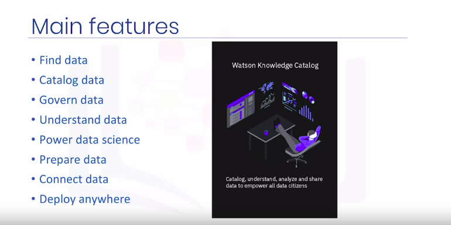</a>
				

* Watson Knowledge Catalog corresponds to the 
	1. Data Asset Management
	1. Code Asset Management
	1. Data Management
	1. Data Integration and Transformation
* Watson Knowledge Catalog is a data catalog that is integrated with an enterprise data governance platform
	* It also merges the analytics capabilities of Watson Studio
* The data catalog assists data scientists to easily 
	1. find
	1. prepare
	1. understand
	1. use the data as needed
* Watson Knowledge Catalog protects data from misuse and enables the sharing of assets with automated, dynamic masking of sensitive data elements
* Data-profile visualizations, built-in charts and statistics help users to understand data assets
* Seamless integration with Watson Studio helps data citizens to drive production of their data in a suite of powerful data science, AI, machine-learning and deep-learning tools
	* Joining with Watson Studio directs the building, training, and deploying of models
* Users can interactively discover, cleanse, and prepare data with a built-in data refinery
* Possible connections to more than 30 IBM and third-party data sources help to catalog and use your data in the original locations
	* IBM Watson Knowledge Catalog has various deployment choices on IBM Cloud™ and can be run anywhere with IBM Cloud Pak™ for Data
	* The latter is a fully-integrated data and AI platform built on Red Hat® OpenShift® Container base
	* It can be deployed easily into any public or private cloud or other enterprise platforms
* A catalog contains metadata about the contents of assets and how to access them. And a set of collaborators who need to use the assets for data analysis
* The metadata is stored in an encrypted IBM Cloud object storage instance
	* Any data that you want to store in the Cloud, you can upload to the cloud object storage of your choice, and then specify that object storage when you create the catalog
* This split between where the data's metadata is stored and the actual location of the data is important
	* It means that you can keep your data where ever it is. You don't need to move it into the catalog because the catalog only contains metadata
* You can have the data in unpremises data repositories in other IBM cloud services like Cloudant or Db2 on Cloud and in non-IBM cloud services like Amazon or Azure, in streaming data services or even dark data sources like PDFs
* Included in the metadata is how to access the data asset. In other words, the location and credentials
	* That means that anyone who is a member of the catalog and has sufficient permissions can get to the data without knowing the credentials or having to create their own connection to the data
				

				  
				

* On the Browse Assets tab you can see "recommendations", "highly rated assets", and "recently created assets", as well as a list of all the assets
	* You can type a search term to find assets, and you can filter by asset type, such as Data Asset or Notebook. Or filter by tags that were assigned to the asset when it was added to the catalog
				

				  <a href="javascript:void(0)" rel="noopener">
					 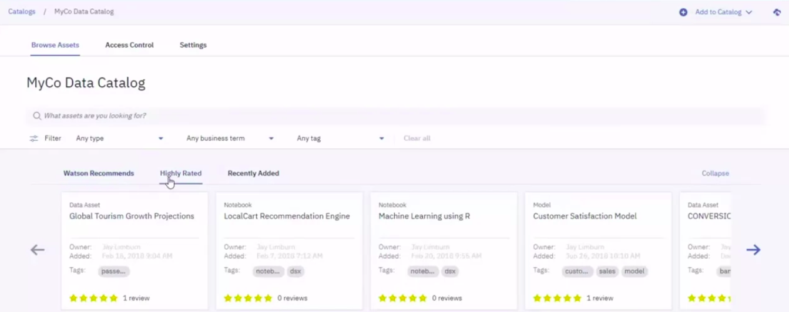</a>
				

* When you view an asset, you get a preview of the data and other information like a description, ratings, tags, where the source is located, and any classifications
				

				  <a href="javascript:void(0)" rel="noopener">
					 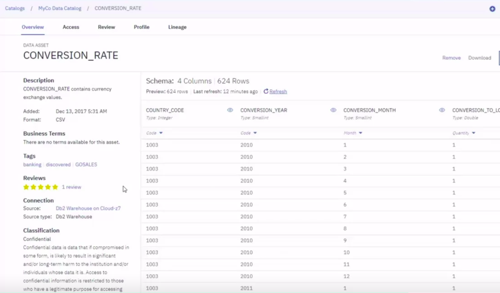</a>
				

* When assets are added to a catalog with Data Policies enabled, Watson Knowledge Catalog automatically profiles and classifies the content of the asset based on the values in those columns
* The Profile tab contains more detailed information about the inferred classifications
* You can see the other possibilities for classifying each column and the confidence scores for those other possibilities
				

				  
				

* On the Access Control tab, you can see the current list of catalog members. you can also add members which is pretty similar to adding collaborators in a project
	* Most catalog members will likely have the __editor role__
	* The __viewer role__ is intentionally restricted
	* Only a select few users will have the __admin role__
				

				  
				

* Watson Knowledge Catalog includes capabilities to automatically mask sensitive data according to your organization's governance policies
	* For example, you can see in the diagram that the first name, last name, and gender data in the data set have been masked
				

				  <a href="javascript:void(0)" rel="noopener">
					 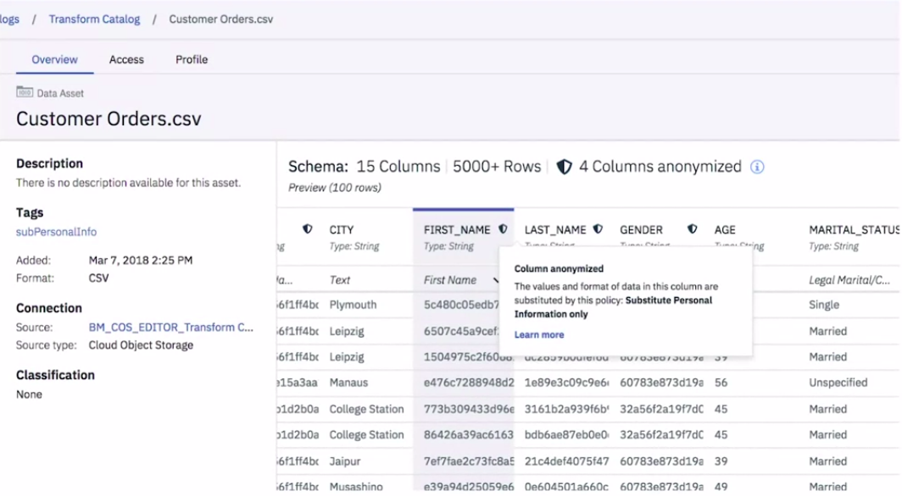</a>
				

### Data Refinery

* __Simplifying Data Preparation__
	* Data scientists often end up spending a lot of time doing mundane tasks like cleansing, shaping and preparing data
		* Typically these tasks are roadblocks for starting the more enjoyable part of analyzing the data sets or building and training machine learning models
	* Data sets typically are not in a format that can be readily used.
		* They first need to be cleansed, refined before they are useable by a data scientist.
	* IBM Data Refinery addresses this issue and simplifies the task of refining data and its workflows
	* It provides a self-service data preparation environment where you can quickly analyze, cleanse and prepare data sets
	* Data refinery is available with Watson Studio on public cloud, private cloud and desktop
					

					  
					

### SPSS Modeler Flows in Watson Studio

* SPSS Modeler Flows is a part of Watson Studio, which was inspired by another product, IBM SPSS Modeler
* Modeler flows include some data management capabilities, as well as tools for 
	1. data preparation
	1. visualization
	1. model building
* All flows are created using a drag-and-drop editor and consist of “nodes” of various types, with data “flowing” from one node to the next according to their connections
* Sample Modeler Flow
	*  A sample Modeler flow shown below includes
		1. two data source nodes shown in purple on the left
		1. type, aggregate, filter, merge, filler, and partition nodes in the middle
		1. 2 model building nodes shown in pentagons
	* Once a flow is executed and the models are built, the upside-down pentagon "model Nuggets" are created
		* They can be used to see information about the models and to get predictions for new data
	* The three green square nodes on the right provide model evaluation information in the form of tables and charts
					

					  
					

* SPSS Modeler flows can be created by dragging different types of nodes from the left, the part of the screen called the “palette,” to the "canvas," the main part of the screen
	* Each flow starts with one or more data sources located in the “Import” group, and can include some or all other types of nodes
					

					  
					

* By connecting new data sources to the model nugget, you can get predictions on new data
* The Confusion Matrix view shows how model predictions on the training data matched the observed target values
* Feature Importance displays a diagram that indicates the relative predictive strength of various model inputs
* the Network Diagram gives a visual representation of the neural network model we built
* the input layer, with units corresponding to each continuous predictor and each category of the categorical predictors
* a bias unit that is usually present in each layer of a neural network
					

					  
					

### IBM SPSS Modeler

* Two IBM products that are very helpful for data scientists
	1. __IBM SPSS Modeler__
		* IBM SPSS Modeler includes data management capabilities and tools for data preparation, visualization, model building and model deployment
		* The product was created by Integral Solutions Limited in the United Kingdom in 1994 and was originally called Clementine
		* It was acquired by a company called SPSS in 1998 and SPSS was in turn acquired by IBM in 2009
		* SPSS Modeler is a data mining and text analytics software application
		* It's used to build predictive models and conduct other analytics tasks
		* It has a visual interface that enables users to leverage statistical and data mining algorithms without programming
		* One of its main goals from the beginning was to create complex predictive modeling pipelines that are easily accessible
		* A sample modeler stream shown here includes one round data source node, three triangular graph nodes, one hexagonal node for computing, a new variable, and a square node for an output table
			* Below the canvas, we can see the rich node palette with separate tabs for data sources, record in field operations, graphs, models, output and so on
			* Nodes and different tabs have different shapes with Pentagon's used for modeling nodes
					

					  
					

		* Sample Stream, Example
			* Telecommunication Churn
				* It starts with a data set of telecommunications records and the goal is to build a model to predict which customers are about to leave the service otherwise known as churn
				* The data source is shown by the round node on the left side, a hexagon type node typically follows a data source node and it enables us to specify roles, target predictor or none And measurement levels such as continuous nominal or flag for all variables
				* The term flag is used to denote a variable with two categories one of which can be considered positive and the other negative
					

					  <a href="javascript:void(0)" rel="noopener">
						 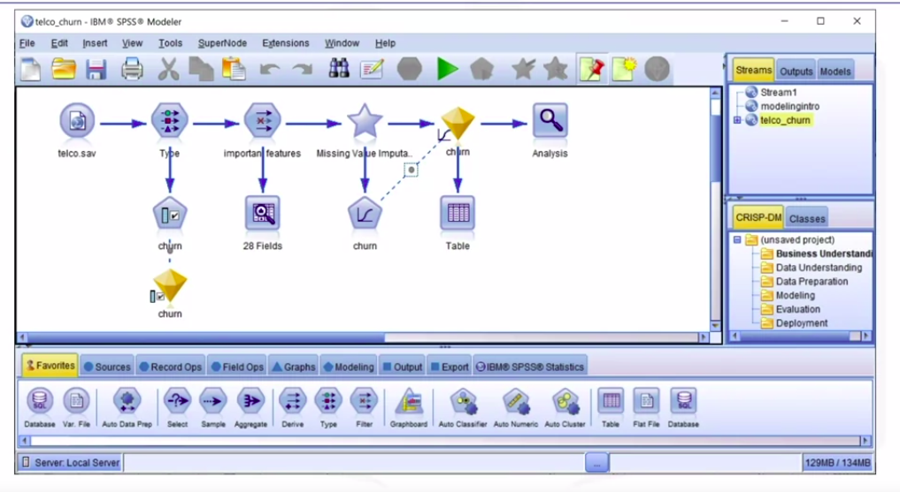</a>
					

				* The original data set has many fields and some of them are not relevant to the target variable, so we first need to decide which fields are more useful as predictors. There is a feature selection modeling node that helps to do this
					

					  
					

				* After the stream with the feature selection node is executed a yellow model nugget gets created below it in the flow diagram.Using that nugget we can generate a filter node that filters out the variables that are not good predictors for the target
					

					  
					

				* The data audit node located below the filtering node shows various properties of the data such as numbers of outliers in each variable and the percentage of valid values
				* It can also help to create a special node for missing value imputation that is replacing missing values of a variable with some valid values that can be selected based on domain knowledge
					* Here variable log toll has greater than 50% missing values and we will specify a value the mean to replace them
						

						  <a href="javascript:void(0)" rel="noopener">
							 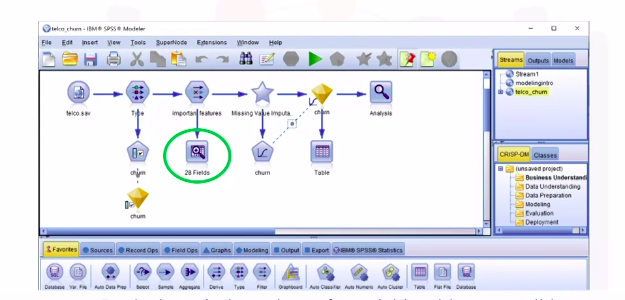</a>
						

						

						  <a href="javascript:void(0)" rel="noopener">
							 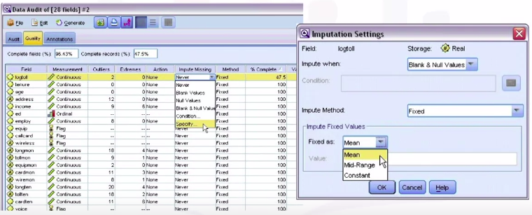</a>
						

				* A __super node__ in modeler is a special node that is not found in the palette but is created by the user with special functions included in it
					* The data audit node enables us to create a super node for imputing missing values. It is shaped as a star and shown on the right of the screen
						

						  <a href="javascript:void(0)" rel="noopener">
							 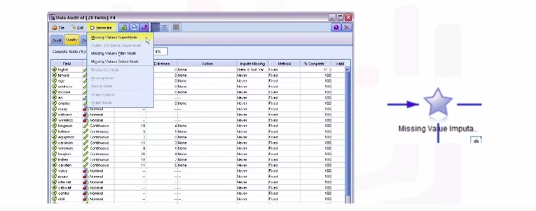</a>
						

				* Finally we attach the logistic regression model node to the stream and click run
					* Another model nugget appears and by clicking it we can see various model information and other output
					* in the output window that opens when we click on the model nugget the summary tab shows the target inputs and some model building settings
					*  Based on certain advanced output settings that were specified before the model was built we can also see a classification table, accuracy, and some other generated outputs for the model
						

						  
						

				* Note that these results are based on training data only
				* To assess how well the model generates two other real-world data you should always use a partition node to hold out a subset of records for the purposes of testing and validation
				* Then, in the model setup screen select the use partitioned data check box
				* This will help detect and avoid model overfitting
						

						  
						

				* Overfitting is defined as having significantly higher accuracy on the training data
					* Data used for training the model then on tests or unseen data
				* The yellow model nugget added earlier can also be used to compute predictions, also called scores on the original data or on a new data source
				* All we need to do is to connect the data source in question to the nugget, make sure it has the predictor variables used in the model, and create an output to a table or other structure for storing the scores
						

						  <a href="javascript:void(0)" rel="noopener">
							 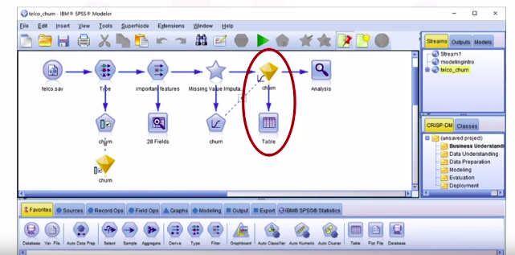</a>
						

				* The analysis node is the final node in the stream
					* It attaches to a model nugget and when executed it will compute some model evaluation metrics, auch as a confusion matrix and accuracy
						

						  
						

		* IBM SPSS Modeler offers a rich modeling palette that includes many classification, regression clustering, Association rules and other models
		* IBM SPSS Modeler also contains large selections of data source types, data transformations, graphs, and output notes
						

						  
						

	1. __SPSS Statistics__

### SPSS Statistics

* **IBM SPSS Statistics** evolved from an original product that was released in 1968
	* That product was called **S**tatistical **P**ackage for **S**ocial **S**ciences or **SPSS**
* IBM SPSS Statistics is a statistical and machine learning software application and is widely used in academia, government agencies, and large enterprises
* It’s used to build predictive models, perform statistical analysis of data, and conduct other analytic tasks
* It has a visual interface, which enables users to leverage statistical and data mining algorithms without programming, although the interface is very different from Modeler
						

						  <a href="javascript:void(0)" rel="noopener">
							 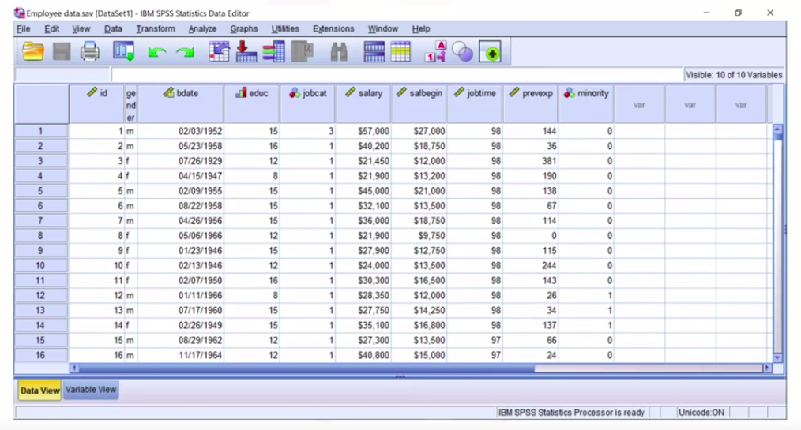</a>
						

	* the main section of the screen looks very much like a spreadsheet; it displays data and allows manual editing
	* At the bottom of the screen, we can see two tabs
		1. Data View
			* it displays data and allows manual editing
		1. Variable View
			* In the Variable View, we can see and edit the information about all variables, including names, labels, data types, and measurement levels
			* We can also specify labels for values of categorical variables, and missing values
	* At the top of the data window is a menu. Under File, if you select __Import Data__, you will see a list of a wide variety of data formats that you can import
		* The product uses its own data file format with the extension **`.sav`** that saves all the information about the variables we just saw in Variable view
		* The menu enables importing from and exporting to many other formats
						

						  <a href="javascript:void(0)" rel="noopener">
							 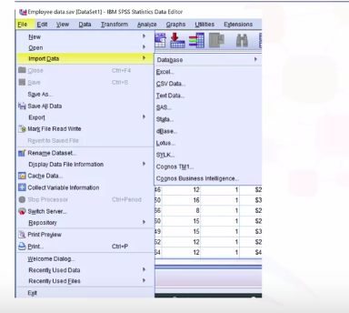</a>
						

	* Under __Data__, you’ll find an extensive menu of possible data operations
		* Note that Data Validation can be performed using user-defined rules that specify the expected behavior of variable values
		* For example, if the date and month are kept in separate columns, the date cannot exceed 31, but for February, the date can’t exceed 29
			* A special rule can therefore be created and applied during data validation. Additionally, you can enable some checks, such as percentage of missing values in a record or in the field
						

						  
						

	* When you click the __Transform__ menu item, you’ll find a variety of available data transformations
		* Under __`Compute Variable…`__ you can write a formula for a new variable based on existing variables
		* You can use any of the many mathematical and statistical functions available in the product
		* You also have the option to use automatic data preparation, similar to Modeler
						

						  
						

	* In the __Analyze__ menu, you will see many types of statistical and machine learning analysis
		* Under __Regression__, there are a variety of regression-related models
		* There are other kinds of regressions that appear separately on the Analyze menu, including
			1. General Linear Model
			1. Generalized Linear Models
			1. Mixed Models
			1. Loglinear
						

						  <a href="javascript:void(0)" rel="noopener">
							 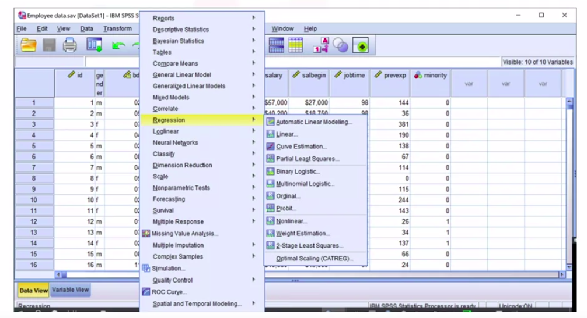</a>
						

* __SPSS syntax__ is a special programming language
	* Once we have the syntax, we can execute it, manually edit it, store it for later use, or send it to other users of IBM SPSS Statistics
	* Experienced SPSS users can write the code from scratch, while others might prefer to have it generated by the graphical interface
	* Remember, the option to paste syntax is available in throughout the program
		* If the syntax is generated by all the steps in a data analytics process -- opening the data set, applying any data transformations, building models -- and then saved as a syntax file with the extension `.sps`, it’s similar to saving a stream in IBM SPSS Modeler

### Model Deployment with Watson Machine Learning

* __How to deploy models?__
	* In many practical scenarios, models are built and deployed by different teams, using different programming, and perhaps human languages
	* The teams will use different computing and data storage environments, and It might prove difficult to translate your program and the associated data preparation and post-processing steps from one environment to the other
						

						  <a href="javascript:void(0)" rel="noopener">
							 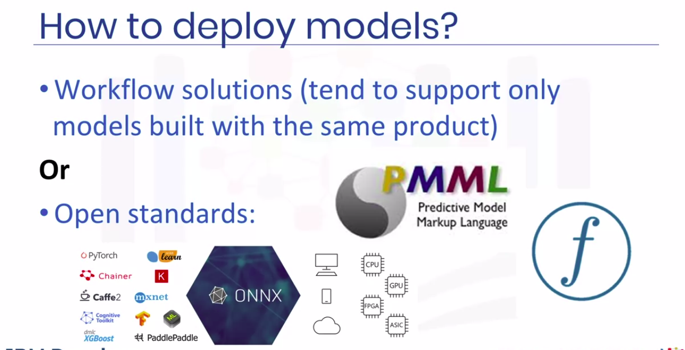</a>
						

* __Some workflow solutions__
	* Currently there are several approaches you can use to solve this problem, some commercial, some open source
						

						  
						

	* Yet each one typically supports only a subset of all possible models, from building them to deploying, so a user gets locked into a specific framework
* __Open Standards for Model Deployment__
	* Open standards for model deployment are designed to support model exchange between a wider variety of proprietary and open source models
	* __Predictive Model Markup Language__, or __PMML__, was the first such standard, based on __XML__
		* It was created in the __1990s__ by the __Data Mining Group__, a group of companies working together on the open standards for predictive model deployment
		* IBM and SPSS were among the founding members of the Data Mining Group
		* PMML 4.4 was recently released
			* It includes 17 statistical and machine learning models and many data transformations, built-in functions, ways to combine multiple models together, and other features
		* This standard is widely known and used. The products we looked at earlier -- Watson Studio, IBM SPSS Statistics, IBM SPSS Modeler -- enable users to export most models in PMML
		* In 2013, a demand for a new standard grew, one that did not describe models and their features, but rather the scoring procedure directly, and one that was based on __JSON__ rather than __XML__
			* This led to the creation of **P**ortable **F**ormat for **A**nalytics, or __PFA__
		* __PFA__ is now used by a number of companies and open source packages
						

						  
						

						

						  
						

* **ONNX** or **O**pen **N**atural **N**etwork e**X**change
	* After 2012, deep learning models became widely popular. Yet PMML and PFA did not react quickly enough to their proliferation
	* In 2017, Microsoft and Facebook created and open-sourced **O**pen **N**eural **N**etwork e**X**change, or __ONNX__
						

						  
						

	* Originally created for neural networks, this format was later extended to support __Traditional Machine Learning__ as well
	* There are currently many companies working together to further develop and expand ONNX, and a wide range of products and open source packages are adding support for it
						

						  
						

* __IBM Watson Machine Learning__
	* Watson Machine Learning is IBM’s commercial offering designed for model deployment
	* It supports deployment of models built with most open source packages, as well as those expressed in __PMML__ or __ONNX__
	* It also supports deployment of IBM SPSS Modeler streams and Modeler flows from Watson Studio
	* Deployment can be done using a graphical interface or Python code, and can be for online scoring through a REST API or batch scoring
						

						  
						

* Code Snippet for Integrating Scoring
	* Watson Machine Learning helps integrate a deployed model into applications in the form of code snippets in several programming languages
						

						  
						

### Auto AI in Watson Studio

* IBM SPSS Modeler and Watson Studio Modeler flows allow you to graphically create a stream or flow that includes data transformation steps and machine learning models. Such sequences of steps are called __data pipelines__ or __ML pipelines__
* __AutoAI Features__
	* The AutoAI system was developed by IBM Research experts in collaboration with IBM Distinguished Engineer and two-time Kaggle Grandmaster Jean-Francois Puget
	* It provides a graphical interface to create and deploy machine learning models with real time visualizations
	* AutoAI automatically performs typical machine learning steps, such as
		1. Data preparation
		1. Model selection
		1. Feature engineering
		1. Hyper-parameter optimization
		1. Users can view the progress on the graphical interface
						

						  
						

* The pipelines can be saved as Machine Learning assets in the Watson Studio project
	* Then they can be deployed and tested
* Currently AutoAI is available only for classification and regression models; there is a plan to add time series model support in the future

### IBM Watson OpenScale

* IBM Watson OpenScale is a product that includes several important features
	1. __Fairness__ 
		* It can test the model and its predictions for fairness and apply ways to overcome bias
	1. __Explainability__
		* It can also help to provide explanations for model predictions that are often hard to get but are necessary for compliance in some application areas
	1. __Model Monitoring__
		* It monitors the model performance and can detect its deterioration, or "model drift," over time
		* It can alert the users when drift is detected and explain which predictors are causing it
		* We can specify criteria under which the model gets automatically retrained on fresh data
	1. __Business Impact__
		* It also helps to measure how the model helps the business
		* Correlate model metrics and business KPIs to measure business impact; actionable metrics and alerts
						

						  <a href="javascript:void(0)" rel="noopener">
							 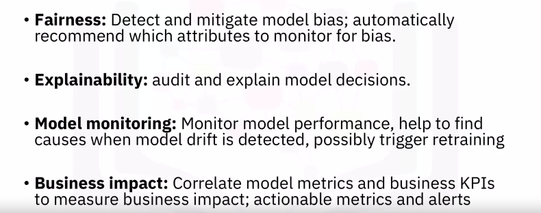</a>
						

* The attributes to monitor for bias are automatically recommended based on prior experience. They can be edited as needed
* OpenScale then keeps track of model predictions for the specified groups and checks for bias in the predictions
* Users need to know that their AI models are fair, but the data their models were trained on can include unwanted biases which may unintentionally be included in the resulting models
* IBM Watson OpenScale can detect bias when a model is in production and not just when it's being built
* What OpenScale does is measure a model's fairness by calculating the difference between the rates at which different groups, for example, women versus men, receive the same outcome
* A fairness value below 100% means that the monitored group receives an unfavorable outcome more often than the reference group
		* Open Scale GUI Sample
						

						  
						

* Explaining Model Predictions
	* Insurance underwriters can use machine learning and OpenScale to more consistently and accurately assess claims risk, ensure fair outcomes for customers and explain AI recommendations for regulatory and business intelligence purposes
						

						  <a href="javascript:void(0)" rel="noopener">
							 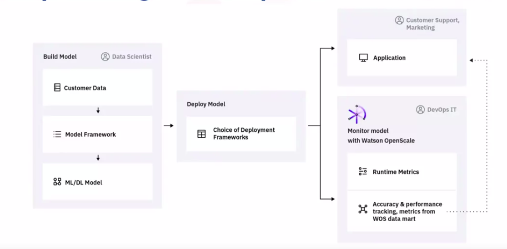</a>
						

* Why does an AI model arrive at a given recommendation or prediction?
	* Users and customers want an explanation and with most models providing this information is not an easy task
	* IBM Watson OpenScale explains predictions in business-friendly language
	* For Example
		* This credit application for instance was predicted to be at risk (check image below)
			* OpenScale determines the features which contributed positively or negatively to that prediction and spells them out
			* The explanation is presented visually, as well as in a sentence based text summary in order to ensure maximum clarity
			* Using proprietary IBM research technology, OpenScale also generates a contrast of explanation
						

						  
						

* The explanations provided by Watson OpenScale can help organizations comply with regulations such as the __Fair Credit Reporting Act__ and __GDPR__, which give customers the right to ask for reasons why their applications were denied
* Before an AI model is put into production, it must prove it can make accurate predictions on test data, a subset of its training data, however, over time production data can begin to look different than training data, causing the model to start making less accurate predictions. This is called __drift__
						

						  <a href="javascript:void(0)" rel="noopener">
							 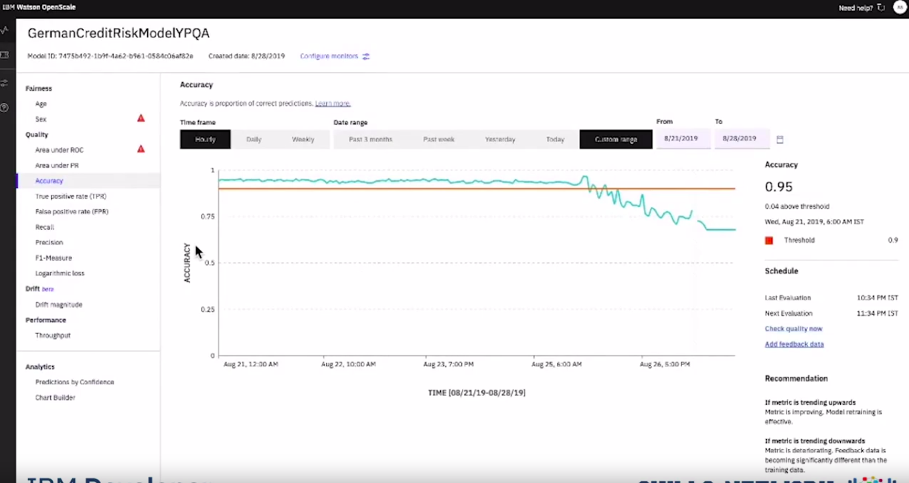</a>
						

						

						  <a href="javascript:void(0)" rel="noopener">
							 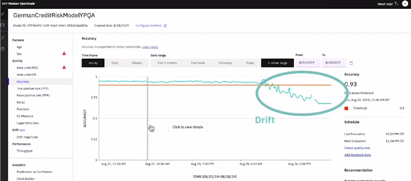</a>
						

* IBM Watson OpenScale monitors a model's accuracy on production data and compares it to accuracy on its training data
	* When a difference in accuracy exceeds a chosen threshold, OpenScale generates an alert
	* Watson OpenScale reveals which transactions caused drift and identifies the top transaction
						

						  
						

* For instance (Check image shown below)
	* 25% of the transactions causing drift in this loan approval model were problematic because of these features, which contain data crucially different than the training data
						

						  
						

	* The transactions causing drift can be sent from manual labeling and used to retrain the model so that its predictive accuracy does not drop at run time
	* Watson OpenScale not only helps identify drift but also highlights its root cause and provides transactions which can be turned into training data useful in fixing drift
						

						  
						

* Open Scale gives you the insight you need to ensure that your models will consistently deliver the results you want over time
	* For instance, 
		* the retrain version of the model based on the recommendations made by Watson OpenScale, started making accurate recommendations alleviating the drift
		* This is just one of the ways that Watson OpenScale helps you ensure your models are fair, explainable and compliant wherever your model was built or is running
						

						  <a href="javascript:void(0)" rel="noopener">
							 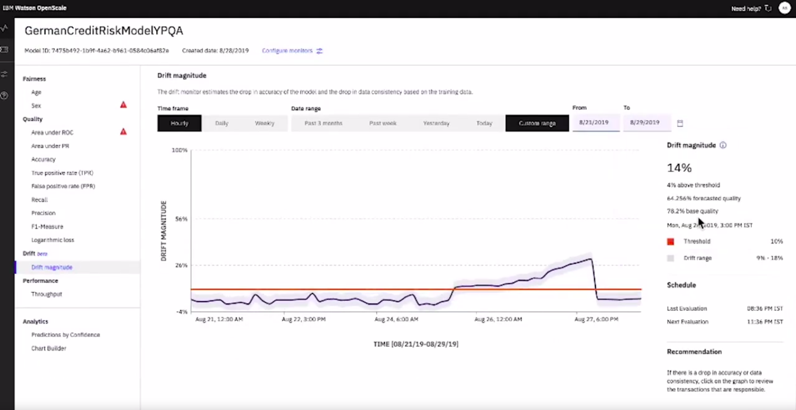</a>
						

